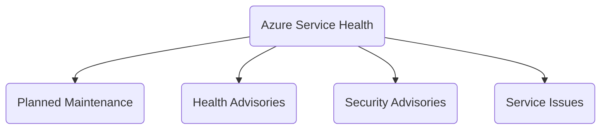

> Learn everything you should know about Azure Infrastructure concepts as a beginner.

Below are the concepts in Azure Infrastructure and Management that you must aware of them.

1. Azure Data Center
2. Azure Regions and Availability Zones
3. Azure Resource Group
4. Azure Resource Manager (ARM)
5. Infrastructure as Code Using ARM Templates
6. Azure Service Health
7. Azure Monitor
8. Azure Mobile App
9. Azure Advisory for optimizing your Azure resources.

### Azure Service Health

[Azure Status](https://status.azure.com/en-us/status) generates all global Azure service status. Azure Service Health broadly check 4 different kind of health.

1. Planned Maintenance
2. [Health Advisories](#Health Advisories)

# 

{: .notice--success}
🏆 **ProTip** \
\
Key point to remember: "**Planned Health & Security Service**"

#### Planned Maintenance

You can find planned maintenance in Azure and notify your clients of an up coming events or reschedule an up coming release.

#### Health Advisories

Changes in Azure Service that require your attention. For example, if features in a service that you use are being deprecated or you need to upgrade your web application because a framework version in Azure App Service is updated.

#### Security Advisories

Notifications or violations that may affect availability of your Azure services.

#### Service Issues

In the Azure portal Azure Service Health list down all the service issues that may impact you based on your resources in use.

### Azure Mobile App

Azure Mobile App gives an easy and secure way to manage your Azure resources, even when you are out of the office and not near computer.
